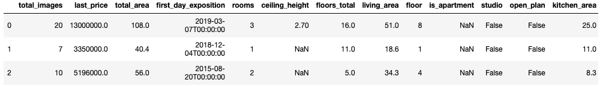
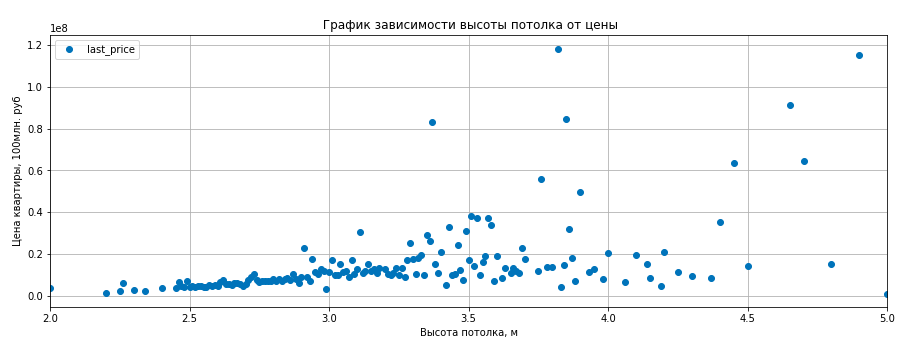
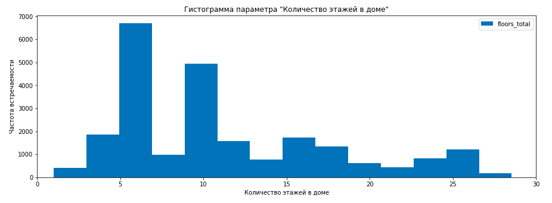
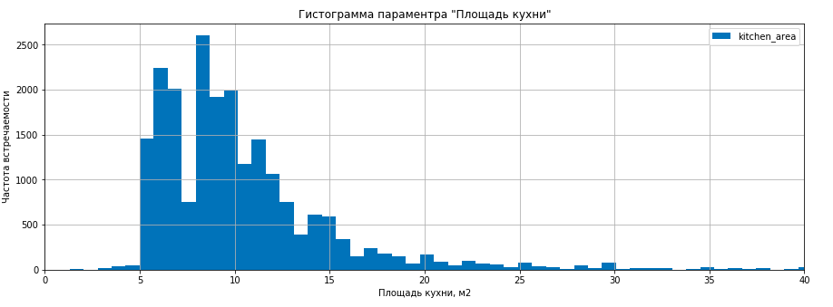

# Тема 2: Исследовательский анализ
## Анализ рынка недвижимости

**Стек:** python / pandas / matplotlib / pymystem3

**Задача:** По имеющимся данным сервиса Яндекс.Недвижимость нужно научиться определять рыночную стоимость объектов недвижимости. Задача — установить параметры. Это позволит построить автоматизированную систему: она отследит аномалии и мошенническую деятельность. 

**План реализации проекта:**
1. Импорт библиотек. Загрузка данных
2. Предобработка данных
3. Анализ данныз
4. Выводы по результатам анализа

## Реализация проекта

### Импорт библиотек. Загрузка данных

Имеем данные вида:

Всего в нашем распоряжении датасет из 23699 строк и 22 параметров. Многие параметры имеют большое количество пропусков и тип данных несоответствующий содержимому.

### Предобработка данных

Анализируем и обрабатываем каждый раздел отдельно.

**Промежуточные выводы:**

- Более 40% объявлений не имеют данных о высоте потолка. Это много. При этом, любая недвижимость имеет этот параметр
- Имеем 23 квартиры с высотой потолка более 20 метров . Скорее всего, люди просто допустили опечатку, поставив разделитель в другом месте. Передвинув запятую, получим адекватный метраж - 2.5, 2.7 и т.д. Исправляем выстоту потолка и включим объявления в общую статистику

Найдем связь между ценой квартиры и высотой ее потолка:

Здесь невооруженным вглядом видна искомая нами корреляция до значений высоты потолка ~ 3,2м. Дальше появляется сильный разброс. 

Посмотрим на распределение этажности:

Ожидаемый пик на 5-ке. Это объясняется большим количеством панельных хрущевок расположенных как по всей России в целом, так и в Ленинградской области в частности. Чуть меньший пик на 9-ке скорее всего соответствует более поздним постройкам, в основном "брежневкам". График уползает вправо характеризуя бурный рост современных многоэтажных комплексов. В целом, 2 выделяющихся пика - это в основном дома типовой застройки советсткого периода. 

Посмотрим на распределение площади квартир:

Больше всего квартир общей жилой площадью 18-20м2 и около 30м2 т.н. "студий".

Изучим параметр "Площадь кухни"

Согласно СНИП 31-01-2003 минимальный размер площади кухни - 6м2 для 1-ком. квартиры и 8м2 для 2-ком. квартиры и выше. Судя по графику, в датасете есть и совсем крошечные площади менее 5 м2.

 ### Анализ данных
 
### Общий вывод:

 

