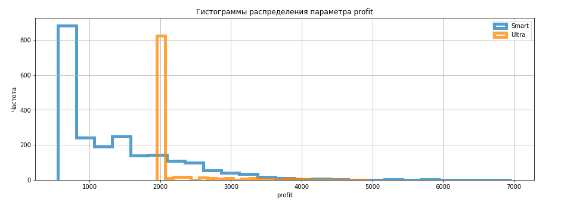

# Тема 2: Статистический анализ
## Определение лучшего тарифа

**Стек:** python / pandas / matplotlib / scipy / numpy

**Задача:** На основании данных сотового оператора выяснить, какой тарифный план подходит клиенту больше.

**План реализации проекта:**
1. Открыть файлы с данными. Изучить данные. Импортировать библиотеки. Составить предварительный план предобработки данных.
2. Подготовить данные. Привести данные к нужным типам. Заполнить пропуски.
3. Добавить необходимые для анализа столбцы.
4. Проанализировать данные.
5. Проверить сформулированные гипотезы.
6. Вывести общий вывод по результатам исследования.

## Реализация проекта

### Импорт библиотек. Загрузка данных

Информация лежит в 5 разных таблицах: 
1. Звонки
2. Интеренет трафик
3. Сообщения
4. Описание тарифов
5. Информация о пользователях

Анализируем таблицы, составляем план предобработки, и предобрабатываем.

Далее, чтобы подобрать оптимальный для пользователя тариф, вычислим некоторые переменные: 

- Количество сделанных звонков и израсходованных минут разговора по месяцам;
- Количество отправленных сообщений по месяцам;
- Объем израсходованного интернет-трафика по месяцам;
- Помесячную выручку с каждого пользователя 

Джоиним таблицы и приступаем к анализу:

Цель: Описать поведение клиентов оператора, исходя из выборки:

1. Сколько минут разговора, сколько сообщений и какой объём интернет-трафика требуется пользователям каждого тарифа в месяц?
1. Посчитать среднее количество, дисперсию и стандартное отклонение.
1. Построить гистограммы.
1. Описать распределения.

Вывод:
**Параметр "количество минут"**: Гистограмма пользователей тарифа Smart стремиться к нормальной. Имеет длинный положительный хвост. Около 40% пользователей тарифа Smart - выходят за рамки бесплатного лимита. Большая их часть укладывается в длительность разговоров - 1000 минут в месяц.

График пользователей Ultra не похож на нормальынй. Характеризуется высоким размахом значений. Имеет почти в 2 раза бОльшее стандартное отклонение. Это говорит о том, что для многих тариф Ultra является неэффективным в количестве предоставленных для разговора минут. При этом, сама цифра в 3000 минут завышена, так как никто из пользователей не исчерпал и 1700 минут разговора.

При этом, количество пользователей разговаривающих более 750 минут в месяц и пользующихся тарифом Ultra, в ~2 раза выше чем среди клиентов Smart.

**Параметр "количество смс"**: Обе гистограммы имеют схожую форму. Гистограмма Ultra характеризуется меньшей плотностью и более длинным положительным хвостом. При этом оба графика имеют пик около нуля.

Мы наблюдаем, что 75% пользователей пользователей тарифом Smart укладываются в бесплатный лимит - 50 смс.Совсем малое количество людей превышает его более чем в 2 раза.

Пользователи Ultra пользуются отправляют смс чаще. Мы видим что есть даже те, кто отправляет более 150 сообщений. Среди пользователей Smart таких нет.

**Параметр "объем трафика"**: График пользователей Smart стремиться к нормальному. Наблюдаем тонкий положительный хвост. 75% клиентов не прывашают объем израсходонного трафика в 20гб. Около половины тратят в среднем 12гб-20гб. Пик находится как раз где-то в районе 15гб - верхней границы бесплатного лимита.

График тарифа Ultra похож на распределение Стьюдента. Характеризуется толстыми длинными хвостами по бокам. В среднем, пользователи тратят уже 19.5гб трафика. Наблюдается еще большое количество пользователей расходующих больше верхней границы бесплатного лимита в 30гб.

### Проверка гипотез
- Средняя выручка пользователей тарифов "Smart" и "Ultra" различются
- Средняя выручка пользователей из Москвы отличается от выручки пользователей из других регионов;

### Проверка гипотезы различной вырочки для тарифов

**Н0:** Выручка пользователей тарифа "Smart" значимо не различается с выручкой пользователей тарифа "Ultra"

**Н1:** Выручка пользователей тарифа "Smart" значимо различается с выручкой пользователей тарифа "Ultra"

В качестве уровня статистической значимости возьмем наиболее часто используемый **p-value=0.05**

**По результатам  t-теста получили p-value ~ 0.**

Для наглядности, представим рассматриваемые параметры графически:

**Вывод: Отклоняем нулевую гипотезу**

Выручка пользователей тарифа "Smart" **значимо различается** с выручкой пользователей тарифа "Ultra"

### Проверка гипотезы различной выручки пользователей из Москвы и пользователей из других регионов

**Н0:** Выручка пользователей из Москвы **значимо не различается** с выручкой пользователей из других регионов"

**Н1:** Выручка пользователей из Москвы **значимо различается** с выручкой пользователей из других регионов"

В качестве уровня статистической значимости возьмем наиболее часто используемый **p-value=0.05**

**По результатам  t-теста получили p-value ~ 0.5**

Для наглядности, снова представим рассматриваемые параметры графически:

**Вывод: Нет причин отклонять нулевую гипотезу**

Выручка пользователей из Москвы **значимо не различается** с выручкой пользователей из других регионов"

### Ответ на главный вопрос исследования

Выясним какой тариф в среднем приносит больше денег. В качастве оценочного параметра воспользуемся средним значением. Больше денег, в среднем, приносят пользователи тарифом Ultra. При этом, подавляющее большинство из них, не может израсходовать весь бесплатный пакет, поэтому вся выручка ограничивается ежемесячной платой за тариф. У пользователей тарифом Smart другая ситуация: 74% пользователей выходят за рамки бесплатного пакета, что часто приносит бОльший ежемесячный доход с клиента.

**Вывод:** Несмотря на изложенные выше особенности, выгоднее все-таки более дорогой тариф Ultra.

### Общий вывод:
Мной было проведено исследование пользователей различными тарифами оператора "Мегалайн".

По результатам исследования выявлены значимые статистические различия в выручке пользователей разных тарифов. При этом, между выручкой пользователей из различных регионов и пользователей из Москвы значимых различий нет.

Выявлено, что более выгодным для оператора связи является тариф Ultra.
