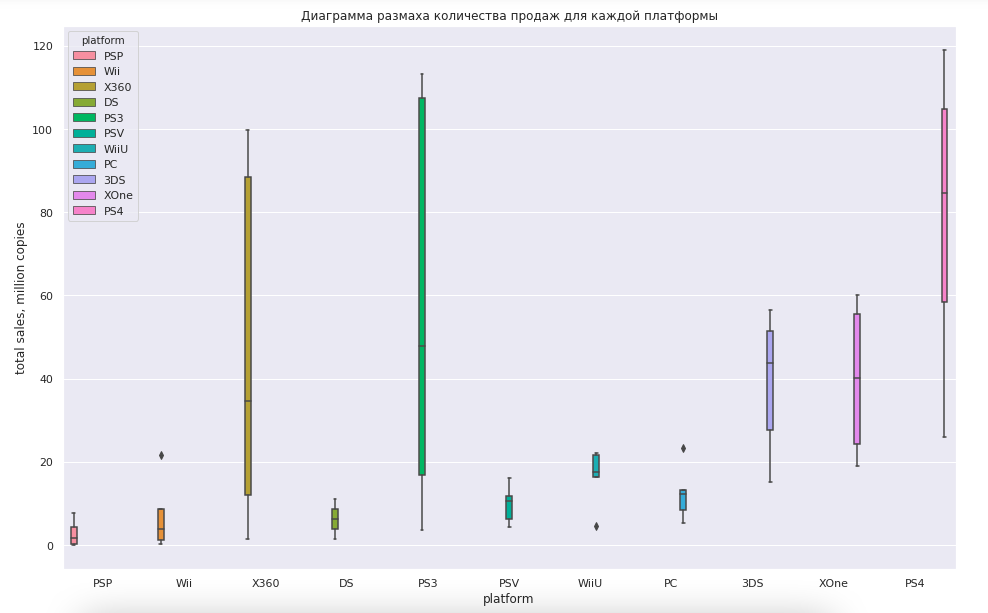
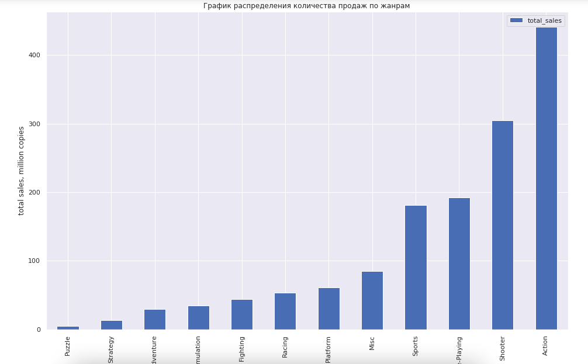
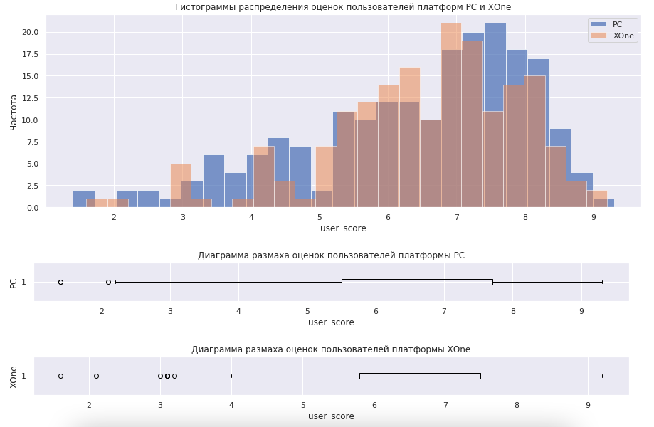
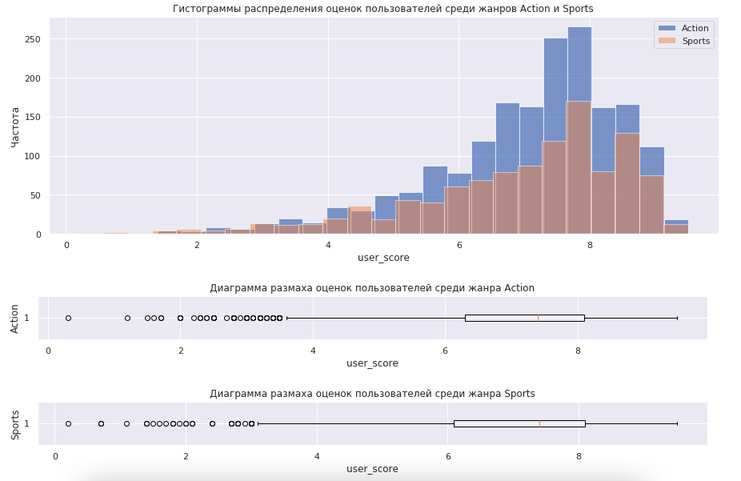

# Сборный проект
## Анализ рынка игровой индустрии

**Стек:** python / pandas / matplotlib / scipy / numpy / seaborn

Описание проекта: Интернет-магазин продаёт по всему миру компьютерные игры. Из открытых источников доступны исторические данные о продажах игр, оценки пользователей и экспертов, жанры и платформы. 

**Задача:** Выявить определяющие успешность игры закономерности

**План реализации проекта:**
1. Знакомство с данными. Чтение данных. Импорт необходимых библиотек
1. Предобработка данных
1. Исследовательский анализ данных
1. Составление портрета пользователя
1. Проверка гипотез
1. Общий вывод

## Реализация проекта

### Импорт библиотек. Загрузка данных

Информация лежит в датафрейме размера (16715х11) вида:

Данные стандартно грязные. Имеют пропуски, дубликаты, некорректные форматы данных. Приступаем к предобработке.

## Предобработка (тезисно)

- Привели названия колонок к нижнему регистру
- Отбрасываем объекты с пропусками в поле "год релиза"
- 50% игр не имеют информации об оценке критиков. Оставляем без изменений
- Около 50% игр не имеют данных о возрастном рейтинге игры. Оставляем без изменений
- Посчитаны суммарные продажи во всех регионах

#### Вывод:

Большое количество данных не имеют всей информации. Заполнить пропуски нет возможности. Было принято решение продолжить анализ основываясь на известных данных. Согласно теориям статистического анализа - при определенных обстоятельствах, мы можем делать выводы о состоянии генеральной совокупности по выборке из нее. Поэтому, анализируем имеющиеся данные как выборку.

## Исследовательский анализ данных

- Наибольшее количество игр было выпущено в 2007 и 2008 годах. Далее количество релизов пошло на спад, становясь все меньше с каждым годом.
- Продолжительность жизни игровых платформ варьируется от 4 до 11 лет. Медианное время жизни, примерно 7.5 лет. Это касается тех платформ, чья конструкция не предусматривает обновления железа. В то же время, персональные компьютеры не имеют четкого срока жизни.
- Лидирует по продажам платформа PS4. За ней по порядку идут XOne и 3DS. Они же являются самыми потенциально прибыльными платформами. Здесь лидерство тоже за PS4. При этом, у всех без исключения платформ наблюдается падение числа продаж. Наиболее сильм отмечается падение у PS3 и X360. Связано это с закатом эры этих поколений консолей.

- Мы видим, что по количеству продаж сильно лидируют стационарные игровые консоли. Они оставляют далеко позади портативные пристаки, и персональные компьютеры. В целом, большая часть рынка игровой индустрии сосредоточена в руках двух гигантов Sony (серия PS) и Microsoft (серия Xbox). При этом, Sony имеет большую долю, и современное поколение консолей только увеличило этот разрыв. Одна из весомых причин тому - выпуск качественных эксклюзивных проектов для своих консолей. Многие из этих проектов - становятся бестселлерами, и прорывами в игровой индустрии. Microsoft тем же похвастать не может.
- Сильный разрыв в количестве продаж между стационарными консолями и персональными компьютерами может быть обусловлен тем, что "пиратский" рынок на платформе PC развит невероятно сильно. Гораздо проще, даже скачать игру с использованием торрент-сервисов не заплатив при этом ни рубля, чем покупать игру в магазине. Но, с каждым годом вводятся все более строгие ограничения в интернете в целях борьбы с нелегальными игровыми площадками. Поэтому, со временем, ожидается увеличение доли продаж у платформы PC на рынке видеоигр.

- Самым прибыльным и востребованным жанром является Action. За ним следуют Shooter и Role_Playing. Оно в целом и логично. Это, пожалуй, самые зрелищные жанры. Замыкают рейтинг игры категории Puzzle. У них, видимо, меньше всего фанатов:(

## Шаг 4. Составление портрета пользователя для каждого региона

**Жанры:** Во всем мире, кроме Японии, в тройку лидеров входят жанры Action, Shooter, Sports. 
В Японии самым популярным является жанр Role-Playing. За ним следует Action. Остальные категории пользуются гораздо меньшей популярностью, в равнении с этими двумя. 

**Платформы**: Здесь различия уже более весомые. Самой популярной платформой Северной Америки является X360. Оно и логично, так как производителем этой консоли является США. При этом, популярность современного поколения приставок распределилась иначе. Японская PS4 является более популярной в США, чем ее американский конкурент XOne.

В Европе ситуация выглядит иначе. Самая популярная платформа - это PS4. Она почти в 3 раза популярнее своего главного конкурента XOne! Что интересно, предыдущее поколение консолей не имело такого большого разрыва. PS3 оказался примерно в 1.5 раза востребованнее чем X360. Вывод: Sony выигрывает войну за рынок в Европе.

Японцы - люди с другой планеты! Как еще можно объяснить такое кардинальное различие в предпочтениях между ними и остальным миром?! Недосягаемо популярной там является консоль Nintendo 3DS - главный конкурент Sony PSVita. Эту битву Sony проиграли. При этом, важное различие между Японией и остальным миром в том, что лидером среди приставок является портативная консоль! В то время как, например, европейцы, предпочитают полноценную домашнюю приставку. 

Ситуация в "остальном мире" схожа с европейской. Самые популярные платформы от Sony. За ними приставки от Microsoft. При этом заметно, что современная модель консоли XOne оказалась гораздо менее востребованной чем ее старший брат X360.

**Rating**: В целом, ситуация во всех рассматриваемых регионах схожа, кроме Японии. Там большей популярностью пользуются игры, чей рейтинг установить не удалось. В Японии существует местная, достаточно строгая в плане оценки возрастного рейтинга игры компания CERO. Многие игровые продукты имеющие на западе рейтинг 10+, в Японии могут попасть под маркировку строго 18+, либо вообще могут быть запрещены. В силу этого, рынок игровой индустрии в стране восходящего солнца отличается от общемирового. 

Таким образом: 

**Портерет пользователя из NA:**
- Платформа: X360
- Жанр: Action
- Возрастной рейтинг: M

**Портерет пользователя из JP:**
- Платформа: 3DS
- Жанр: Role-Playing
- Возрастной рейтинг: RP

**Портерет пользователя из EU:**
- Платформа: PS4
- Жанр: Action
- Возрастной рейтинг: M

**Портерет пользователя из Other:**
- Платформа: PS4
- Жанр: Action
- Возрастной рейтинг: M

## Шаг 5. Проверка гипотез

- Средние пользовательские рейтинги платформ Xbox One и PC одинаковые.
- Средние пользовательские рейтинги жанров Action и Sports разные.

#### 5.1 Проверка гипотезы "Средние пользовательские рейтинги платформ Xbox One и PC одинаковые"

Сформулируем нулевую и альтернативные гипотезы:

**Н0:** *Средние пользовательские рейтинги платформ Xbox One и PC одинаковые*

**Н1:** *Средние пользовательские рейтинги платформ Xbox One и PC НЕ одинаковые*

p-уровень значимости примем равным **0.05**.

**Результаты теста: p-value: 0.43 > 0.05**

Вывод: **Нет оснований для отклонения нулевой гипотезы**. В действительности, средние пользовательские рейтинги **одинаковые**!

Дополнительно проиллюстрируем разницу в оценках построив гистограммы:

#### 5.2 Проверка гипотезы "Средние пользовательские рейтинги жанров Action и Sports разные"

Сформулируем нулевую и альтернативные гипотезы:

**Н0:** *Средние пользовательские рейтинги жанров Action и Sports одинаковые*

**Н1:** *Средние пользовательские рейтинги жанров Action и Sports НЕ одинаковые*

p-уровень значимости примем равным **0.05**.

Результаты теста: p-value: **0.36 !< 0.05**

**Вывод: Нет оснований для отклонения нулевой гипотезы**. Принимаем, что игры жанров Action и Sports имеют одинаковые пользовательские оценки.

## Общий вывод

В ходе исследования выявлено: 
    
1. **Самой популярной игровой платформой** в мире является **PS4**. Игры этой платформы имеют наибольшее количество продаж, и самые высокие рейтинги. При этом, нужно иметь ввиду, что в Японии игроки предпочитают портативные консоли, такие как PSVita и Nintendo 3DS. Именно поэтому такие платформы там пользуются большей популярностью.

2. Общемировая тенденция - **спад игровых релизов**. Начиная с 2012 года количество выпускаемых игр неуклонно падает. Это можно объяснить усложнением самих проектов. Предположу, что пользователи стали более требовательными к качеству продукта. Поэтому, компании стали делать ставку на сложные и большие, но долгие в разработке проекты.

3. Так же выявлено, что средний **срок "жизни"** одной платформы - **около 10 лет**. Это относится именно к тем консолям, которые не предусматривают обновления железа на более акутальное, как предусматривает PC. При этом, **новое поколение** платформ появляется на свет **каждые 6-7 лет**.

4. Установлено, что **оценки критиков в большей степени** влияют на **успешность** маркетинговой компании проекта, нежели пользовательские оценки. Причины такого явления предположительно связаны с тиражируемостью отзывов критиков, и тем, что пользователи позже получают игру.

5. **Самым популярным игровым жанром является Action**. Возможно, это связано с простотой в освоении игр жанра, их красочностью и эффектностью. Такие игры, часто, умеют глубоко "погрузить" пользователя в свою вселенную и заставить сопереживать своей истории.

6. **Портрет пользователя отличается** для каждого региона. Где-то незначительно, а где-то, как например в Японии, портрет пользователя сильно отличается от общемирового. Связано это, на мой взгляд, с культурными различиями.

7. Проверена гипотеза о равенстве оценок пользователей платформ PC и XOne. Оказалось, что **одни и те же игры имеют разные отзывы** в зависимости от того, на какой платформе их запускают. Вероятно, это обусловлено тем, что определенные категории игр лучше подходят для одних платформ, и хуже для других. Например, шутеры лучше запускать на PC. А игры жанра Action и Sport больше подходят для управления геймпадом. Здесь вам и вибрация и звуковое сопровождение и большой экран телевизора вместо скромного монитора.

8. Проверена гипотеза о равенстве оценок игр жанров Action и Sports. Оказалось, что **распределение оценок у обоих жанров слабо отличается друг от друга**. Возможно, не так важен жанр игры как качество ее исполнения. 
