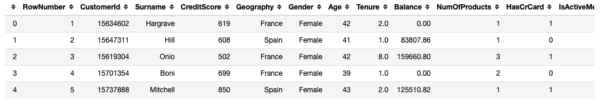
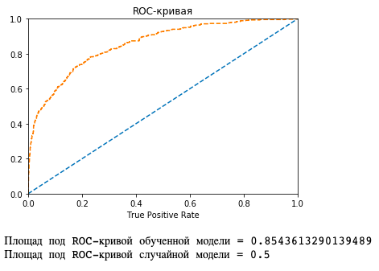
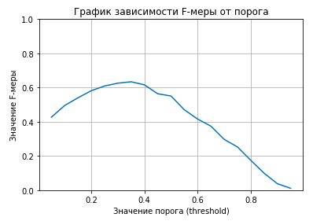
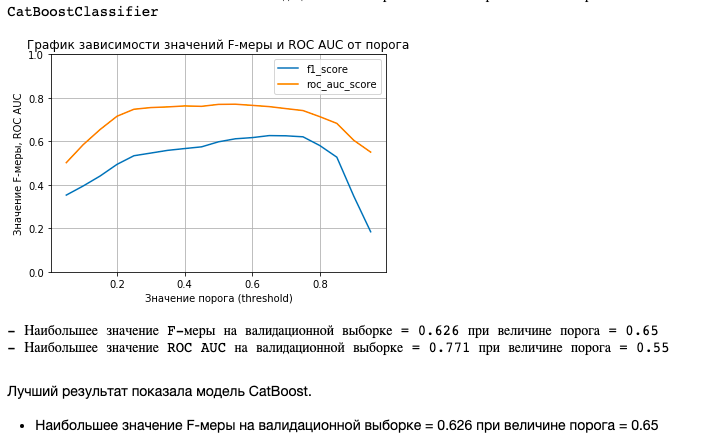
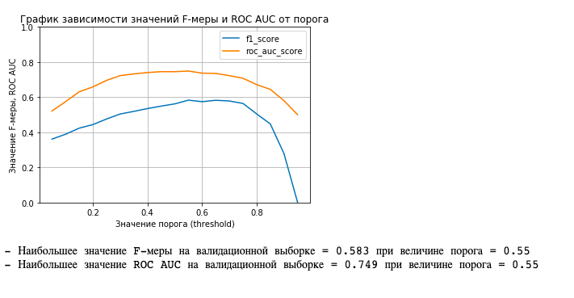

# Тема 5. Обучение с учителем
## Предсказание оттока клиентов банка

**Стек:** python / pandas / scikit-learn / catboost / matplotlib / seaborn 


Из «Бета-Банка» стали уходить клиенты. Каждый месяц. Немного, но заметно. Банковские маркетологи посчитали: сохранять текущих клиентов дешевле, чем привлекать новых.

**Задача:** Нужно спрогнозировать, уйдёт клиент из банка в ближайшее время или нет. Постройте модель с предельно большим значением *F1*-меры (не менее 0.59)

**План реализации проекта:**
1. Подготовка данных. Импорт библиотек
1.1 Грубая предобработка данных
1.2 Предобработка данных для задач машинного обучения
2. Исследование задачи
2.1 Определение выборок
2.2 Обучение модели
2.3 Проверка адекватности модели
2.4 Подбор оптимального порога
3. Борьба с дисбалансом классов
3.1 Метод upsampling
3.2 Поиск наилучшей модели на обучении upsampled выборки
3.3 Метод downsampling
3.4 Поиск наилучшей модели на обучении downsampled выборки
4. Тестирование модели
5. Общий вывод

## Реализация проекта

### Импорт библиотек. Загрузка данных

Информация лежит в датафрейме размера (10000x14) вида:



Данные стандартно грязные. Имеют пропуски, дубликаты, некорректные форматы данных. Приступаем к предобработке.

### Предобработка (тезисно)

- Привели названия колонок к нижнему регистру
- Отбрасываем объекты с пропусками
- Отбросили неинформативные признаки "customerid", "surname", etc.
- Обработали категориальные признаки методом "one-hot-encoding" и в отдельном датафрейме методом "ordinal"
- Нормировали данные
- Проверили выборки на мультиколлинеарность


### Обучение моделей

Выбрали в качестве оценщика модель случайного леса. Перебирали параметры с помощью RandomizedSearchCV. Параметры:
``` 
'max_depth':range(1,20,2),
'n_estimators':range(1,100,5),
'min_samples_split':range(2,20,2),
'min_samples_leaf':range(1,20,2)}
``` 

**Accuracy модели = 0.862**

**Accuracy dummy-модели = 0.801**

Сравним модели наглядно, с помощью ROC - кривой:



F-мера обученной без учета дисбаланса классов модели = 0.53

#### Поиск оптимального порога

Найдем значение порога классификации такое, чтобы значение F-меры было бы максимальным. Построим график зависимости величин:



**Вывод:**

Наибольшее значение F-меры на валидационной выборке = 0.63 при величине порога = 0.35
Значение F-меры на тестовой выборке при том же пороге = 0.58

При наличии дисбаланса классов, такие метрики как accuracy практически не несут никакой информативности. Поэтому, в таком случае, нагляднее будет метрика ROC AUC score, которая вычисляет долю ошибок и правильных ответов. Она слабо зависит от дисбаланса.

Согласно некоторым популярным статьям, получается, что проблема дисбаланса классов до сих пор актуальна и обсуждается. Вероятно, "не так страшен черт, как его малюют", и дисбаланс далеко не всегда сильно влияет на качество модели. Да, в задачах мультиклассификации, дисбаланс играет далеко не последнюю роль. Но, в задачах бинарной классификиации, с использованием моделей RandomForestClassifier, разный вес классов может не нести весомого вклада в качество модели.

Примем последнее утверждение в качетсве гипотезы, которую и проверим в следующем шаге.

### Борьба с дисбалансом классов

Рассмотрим 2 популярных метода работы с дисбалансом: upsampling и downsampling. Для каждого метода найдем лучшую модель, подберем порог, посмотрим графики:

#### Метод upsampling



#### Метод downsampling



### Вывод

Судя по проведенным экспрериментам - моделям чуть лучше удается выявлять закономерности на выборках большего размера (upsampled выборках).

Наиболее высокое значение F-меры демонстрирует модель CatBoost обученная на upsampled выборке. 

На данный момент, лучшие результаты, которых добилась модель это:

- Наибольшее значение F-меры = 0.626 при величине порога = 0.65

Финально продолжим улучшать модель CatBoost показавшую наиболее высокие результы.

### Финальное тестирование:

Лучшие результаты которых удалось достичь в ходе обучения модели:

**Наибольшее значение F-меры = 0.611 при величине порога = 0.65**

## Общий вывод

По результатм проведенного исследования выявлено:

- Модель обученная на выборке без учета дисбаланса классов - показала лучший f1-score на валидационной выборке, но худший на тестовой. Значит, учет дисбаланса помогает модели лучше видеть законометрности и вести себя более стабильно.
- Чуть более высоких значений F-меры удалось добиться на upsampled выборках. Возможно, это не закономерность, а только частный случай.
- Более высокие показатели F-меры демонстрируют модели CatBoostClassifier. 
- Более точных результатов прогноза удается добиться с помощью поиска оптимального порога классификации.

Дополнительно, на задворках проекта, аналогичным образом были обучены модели на выборках с учетом выбросов. Объекты с аномальными объектами были отброшены. Результаты оказались даже хуже, чем у моделей обученных на выборках без учета дисбаланса. В силу этого, данные результаты в проекте не представлены.
