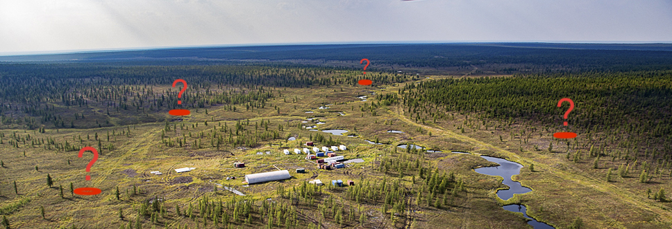
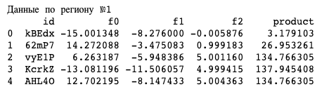

# 06. ML в бизнесе

## Поиск места для скважины

**Стек:** python / pandas / itertools / scikit-learn / scipy / Bootstrap



Задача: Построить модель машшиного обучения, которая подскажет регион, где добыча принесет наибольшую прибыль из информации о 10 000 нефтяных месторождений. Проанализировать прибыль и риски техникой Bootstrap. Нужно оставить лишь те регионы, в которых вероятность убытков меньше 2.5%.

**План реализации проекта:**
1  Загрузка и подготовка данных
1.1  Импорт библиотек
1.2  Распаковка данных
1.2.1  Промежуточный вывод:
1.3  Подготовка данных для целей машинного обучения
1.3.1  Проверка на мультиколлинеарность
1.3.2  Нормирование признаков
1.4  Вывод:
2  Обучение и проверка модели
2.1  Обучение модели
2.2  Проверка модели на адекватность
2.3  Вывод:
3  Подготовка к расчёту прибыли
3.1  Вывод:
4  Расчёт прибыли и рисков
5  Вывод:

## Реализация проекта

### Импорт библиотек. Загрузка данных

Информация лежит в 3-х датафреймах. Каждый фрейм соответствует одному региону.



**Вывод:** На первый взгляд данные хорошего качества. Отсутствуют пропуски и дубляжи. Все признаки приведены к оптимальным типам. Грубая, первоначальная предобработка не требуется. Посмотрим, подходят ли данные в таком виде для машинного обучения...

### Предобработка (тезисно)

- Проверили данные на мультиколлинеарность
- Увеличили признаковое пространство датафреймов с комбинацией имеющихся фичей
- Убрали сильно коррелирующие признаки
- Нормировали выборки

### Обучение моделей

В условии сказано, что оптимальной моделью является модель линейной регрессии. Ее и будем обучать.

***Результаты обучения модели по данным региона №0***

**RMSE = 37.76** <br>
Средний предсказанный запас сырья в регионе = 92.40

***Результаты обучения модели по данным региона №1***

**RMSE = 0.89**<br>
Средний предсказанный запас сырья в регионе = 68.71

***Результаты обучения модели по данным региона №2***

**RMSE = 40.15**<br>
Средний предсказанный запас сырья в регионе = 94.77

Проверим, пошло ли модели на пользу увеличения признакового пространства. Обучим модель с изначальным количеством признаков и сравним результаты:

***Результаты обучения сырой модели***

**RMSE = 37.76**<br>
Средний предсказанный запас сырья в регионе = 92.40


**Вывод:**
- Проведено обучение модели. RMSE колеблется в пределах 0-40.
- Лучшей предсказательной способностью обладает модель обученная на данных по региону №1. Вследствие почти прямой взаимосвязи одной из фич с целевым признаком.
- Сырая и обогащенная модели показали практически идентичные результаты. Увеличение признакового пространства было излишним.
- Проведена попытка увеличения качетва модели путем избавления данных от выбросов. Первый же тест показал худшие результаты в сравнении с контрольной моделью.

### Подготовка к расчёту прибыли¶

Сохраним все ключевые показатели в отдельных переменных:

Бюджет на разработку - BUDGET
Количетво скважин для разработки - BAREHOLS
Доход с реализации единицы продукта - EARNINGS

```
BUDGET = 10e6
BAREHOLS = 200
EARNINGS = 450 
```

Определим минимальное количество запасов сырья, необходимое для безубыточной добычи:

min_stock_raw = BUDGET / EARNINGS / BAREHOLS

Минимально необходимое количество сырья в одной скважине для безубыточной разработки: **111.11 тыс. баррелей**

Вычислим количество сырья в 200 крупнейших скважинах каждого региона и потенциальную прибыль от реализации:

***Регион №0***<br>
Потенциальная чистая прибыль от реализации сырья: **3.34 млрд. руб.**
***Регион №1***<br>
Потенциальная чистая прибыль от реализации сырья: **2.42 млрд. руб.**
***Регион №2***<br>
Потенциальная чистая прибыль от реализации сырья: **2.61 млрд. руб.**

**Вывод:**
Среднего запаса сырья в одной скважине недостаточно для прибыльной добычи ни в одном из регионов. Нужно отбирать самые объемные месторождения.

### Расчёт прибыли и рисков###

Выполним процедуру Bootstrap и найдем 95% доверительный интервал чистой прибыли по каждой из выборок, среднюю прибыль и величину риска.

***Регион №0***<br>

95% доверительный интервал (-0.13 : 0.96)<br>
Средняя прибыль = 0.44 млрд. руб.<br>
Величина риска = 6.20%<br>

***Регион №1***<br>

95% доверительный интервал (0.06 : 0.91)<br>
Средняя прибыль = 0.49 млрд. руб.<br>
Величина риска = 1.10%<br>

***Регион №2***<br>

95% доверительный интервал (-0.15 : 0.95)<br>
Средняя прибыль = 0.40 млрд. руб.<br>
Величина риска = 7.00%<br>

### Общий вывод

По результатам проведенной работы выяснилось, что подходящим под требования (нужно оставить лишь те регионы, в которых вероятность убытков меньше 2.5%.) является регион №1. Другие, имеют несоответствующую величину риска. Так же, регион №1 имеет более высокий показатель средней прибыли и меньший размах доверительного интервала. Плюс ко всему, RMSE данных этого региона меньше 1, что говорит о высокой точности прогнозов.
Таким образом, регион для разработки - это регион №1.
