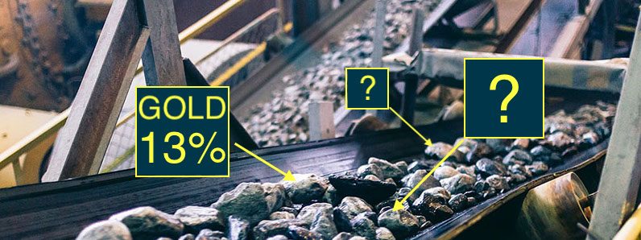
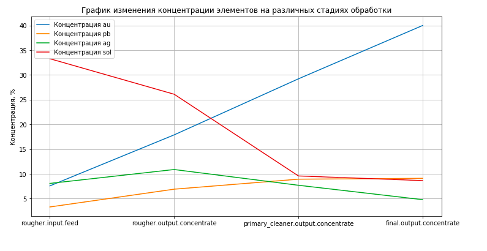
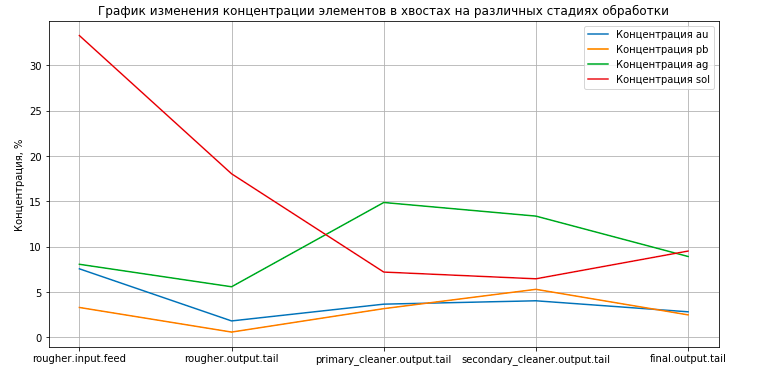
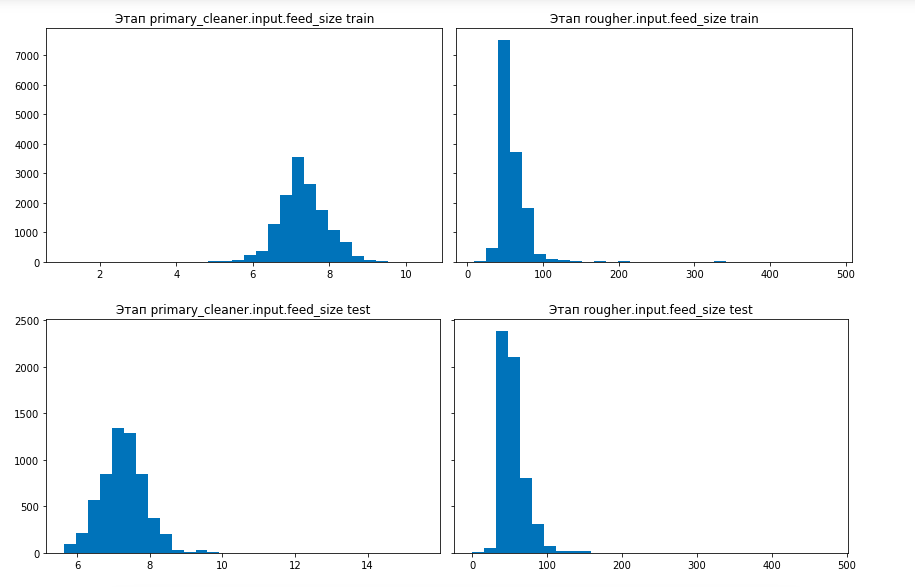

# 07. Cборный проект

## Определение содержания золота в руде

**Стек:** python / pandas / numpy / scikit-learn

**Описание проекта:** Золотодобывающее производство хочет сократить издержки при обработке руды. Для этого предприятие хочет внедрить модель машинного обучения в процесс обогащения золотоносной руды. Нам доступны данные со всех этапов обработки. 

**Задача:** Построить модель машинного обучения, которая поможет предсказать коэффициент восстановления золота из золотосодержащей руды.

***Принципиальная схема производства выгядит так:*** Добытая руда проходит первичную обработку - дробление. Далее, она отправляется на флотацию (обогащение). В результате получается черновой концентрат и «отвальные хвосты», то есть остатки продукта с низкой концентрацией ценных металлов. Затем смесь проходит двухэтапную очистку. На выходе получается финальный концентрат и новые отвальные хвосты.

**План реализации проекта:**
1. Подготовка данных
1. Предобработка данных
1. Анализ данных
1. Обучение моделей
1. Общий вывод

## Реализация проекта

### 1. Импорт библиотек. Загрузка данных

Данные лежат в 3-х датафреймах: train / test / full. full имеет размер (16860 х 87). Важно, при обработке данных использовать только те признаки, которые будут доступны при работе реальной модели. Таким образом, еще одной задачей проекта является корректная обработка признаков.

**Вывод:**  Данные очень грязные. Большое количество пропусков.

### 2. Предобработка (тезисно)

- Проверили корректность формулы вычисления эффективности обогащения. Результаты собственных вычислений совпали с имеющимися в выборках.
- Отбросили часть объектов с отсутствующими данными
- Часть пропусков заполнили методами bfill, ffill

### 3. Анализ данных

**План:**
1. Исследовать изменение концентрации элементов на каждом этапе
1. Проанализировать распределения размеров гранул на обучающей и тестовой выборках
1. Исследовать суммарные концентрации
1. Проанализировать и обработать аномальные значения

#### Исследование изменения концентрации элементов на каждом этапе

**Промежуточный вывод:**

**Rougher.output** - Мы видим, что после первичного (грубого) этапа очистки концентрация золота, серебра и свинца увеличились. При этом, сильно упала концентрация солей. В сырой руде больше половины объема занимают соли. Поэтому, даже незначительное уменьшение их концентрации приведет к увеличению концентрации других компонентов. 

**Primary_cleaner.output** - На второй стадии концентрация золота в продукте продолжает расти линейно. Концентрация свинца тоже увеличилась. При этом, количество свинца и серебра уменьшилось.

**Final.output** - На финальной стадии концентрация золота все подолжает расти линейно, а объемы примесей снижаются. Но, уже не так значительно. Например, концентрация солей на финальной стадии очистки остается практически неизменной. Как и концентрация свинца. Вероятно, отделить свинец от золота гораздо сложнее чем отделить соли от золота. 

#### Исследование концентрации элементов в хвостах:

Задача состоит в том, чтобы на каждом этапе очистки концентрация **ценных** элементов в отвальных хвостах **уменьшалась** и стремилась к нулю, при этом, концентрация **"лишних"** элементов должна **расти**. В идеале, чтобы после первой стадии очистки, концентрация "лишних" элементов в отвальных хвостах была бы равна концентрации "лишних" элементов в сырой руде. 

Мы видим, что на разных стадиях концентрация металлов в отвальных хвостах то растет, то падает. В целом, это характеризует эффективность процесса очистки. На каждом из этапов - уходит в хвосты достаточно высокая часть элементов. 

#### Анализ распределения размеров гранул на обучающей и тестовой выборках

Проверим гипотезу о равенстве средних. Сформулируем гипотезу:

- **Гипотеза Н0**: Размеры гранул в тестовой выборке НЕ отличаются от размеров гранул в тренировочной выборке

- Тогда **Альтернативная гипотеза Н1**: Размеры гранул в тестовой выборке отличаются от размеров гранул в тренировочной выборке.

Результаты проверки гипотез: Отвергаем нулевые гипотезы о равенстве размеров гранул в тестовой и тренировочной выборках. **Размеры гранул в выборках различны!**

#### Исследование суммарных концентраций

- В ходе анализа суммарных концентраций, мы нашли несколько тысяч аномальных объектов, чья концентрация была равна нулю. Такие объекты было решено выбросить из тренировочной и тестовой выборок, так как скорее всего, эти объекты появились в результате отсутствия руды на ленте.

- Так же, было решено оставить объекты значения концентраций которых лежат далеко за пределами усов диаграммы размаха. Оценим, как это скажется на предсказательной способности модели.

- На данный момент выборки почищены от аномалий. Осталось привести данные к "читабельности" т.е. нормировать и разбить на тренировочную и валидную выборки.

**Далее данные поделены на выборки и нормированы.**

### 4. Обучение моделей

В условии сказано, что метрикой качества в задаче является sMAPE. В стандартном инструментарии библиотек такой метрики нет, поэтому функция была написана самостоятельно.

***Результаты обучения моделей***

Лучшей моделью оказалась Ridge.

Dummy model sMAPE score: **20.546 > 17.56** :Best model sMAPE score

### Общий вывод

По результатам работы над проектом реализован прототип предсказания коэффициента восстановления золота (КВЗ) из золотоносной руды. Прототип прошел проверку на адекватность, и показал score лучший чем у dummy модели.

По ходу работы оказалось, что часть данных является ложными, т.е. записывались в момент простаивания производства. Поэтому, следует предусмотреть внесение изменений в сбор данных, с тем, чтобы итоговый датасет был более чистым.

На удивление, оказалось, что более точные предсказания получаются на выборке с гораздо меньшим количеством признаков. Т.е. возможно, более точно определить КВЗ на начальном этапе, еще до момента начала флотации.

Проверена гипотеза о равенстве средних размеров гранул в тестовой и тренировочной выборке. Оказалось, что гранулы имеют разный размер, что может отрицательно сказаться на итоговой предсказательной способности модели.
