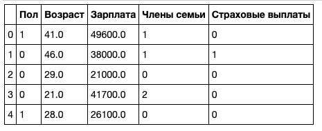
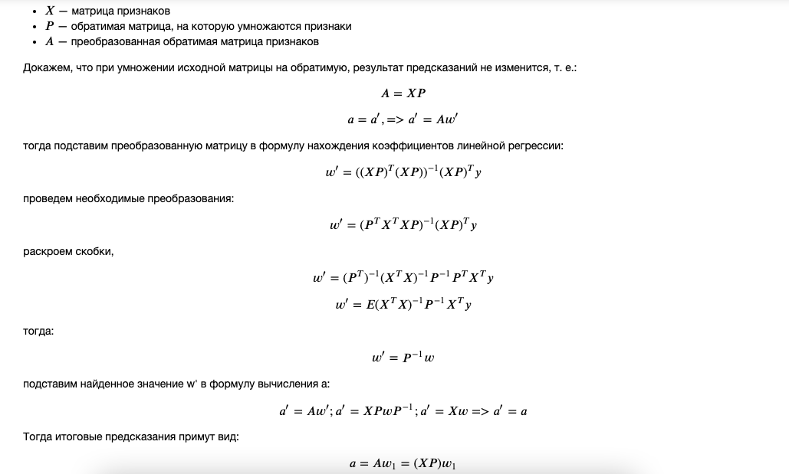

# 08. Линейная алгебра

## Защита данных клиента

**Стек:** python / numpy / scikit-learn

**Описание проекта:** Страховая компания беспокоится за безопасность персональных данных своих клиентов. Предприятие просит помощи в шифровании.

**Задача:** Зашифровать персональные данные клиентов так, чтобы качество модели машинного обучения не ухудшилось.

**План реализации проекта:**
1. Загрузить данные. Изучить. Импортировать необходимые библиотеки
1. Предложить алгоритм шифрования данных. Обосновать выбор
1. Реализовать алгоритм. Протестировать. Экспериментально доказать п.3
1. По результатам работы написать вывод

## Реализация проекта

### 1. Загрузить данные. Изучить. Импортировать необходимые библиотеки

Данные выглядят так:

### Предложить алгоритм шифрования данных. Обосновать выбор

**Алгоритм**

В качестве шифровальщика, - отлично подойдет алгоритм умножения исходной матрицы на обратимую, которая в свою очередь строится на основе генератора псевдослучайных чисел. 

Опишем работу алгоритма пошагово:

1. Определим метрику до преобразования. Для оценки качества моделей будем использовать MSE
1. Преобразуем поступившую матрицу фичей путем домножения ее на рандомную обратимую матрицу размера nxn, где n - количество фичей в исходной матрице.
1. Обучим модель на преобразованных признаках.
1. Составим предсказания и вычислим MSE
1. Сравним MSE обученной на преобразованных признаках модели, с MSE модели обученной на исходном датафрейме признаков.

**Обоснование:**

В результате умножения исходной матрицы на обратимую, положение точек в n-мерном признаковом пространстве не изменится относительно друг друга. Фактически, мы только изменим масштаб каждого признака, но положение объектов не поменяется. Зная, что задача обучения сводится к нахождению такой прямой, которая описывет данные с минимальной ошибкой, и зная, что такая прямая единственна: Новые параметры линейной регрессии **w** хоть и изменят свои значения, но фактически будут стремиться описать ту же самую прямую, что была до преобразования.

Поэтому MSE, (что есть среднее квадратичное отклонение объекта от регрессионной прямой) останется неизменным. Т.о. умножение на обратимую матрицу не меняет векторного представления пространства исходной матрицы. В то время как умножение на необратимую матрицу, изменит саму структуру исходной матрицы. 

### Тестирование алгоритма

Докажем приведенные выше выкладки. Для этого обучим модель на исходных данных и на преобразованных. Сравним MSE. 

- MSE модели на исходных данных: 0.138629

- MSE модели на преобразованных данных: 0.138629

т.о. мы доказали, что умножение любой ненулевой матрицы на обратимую не влияет на качество модели.

### Вывод

Произвели преобразование матрицы признаков, с помощью односторонней функции (произведение исходной матрицы на рандомную обратимую). Экспериментально удалось доказать, что модель после преобразования признакового пространства сохраняет ту же степень качества, что и до преобразования.

На основании вышесказанного предложен алгоритм шифрования данных. Алгоритм реализован.
