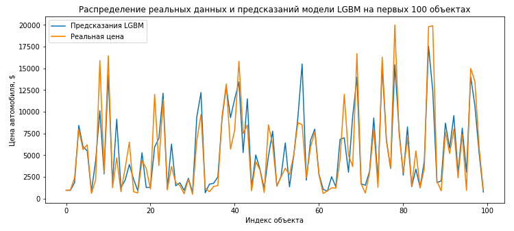
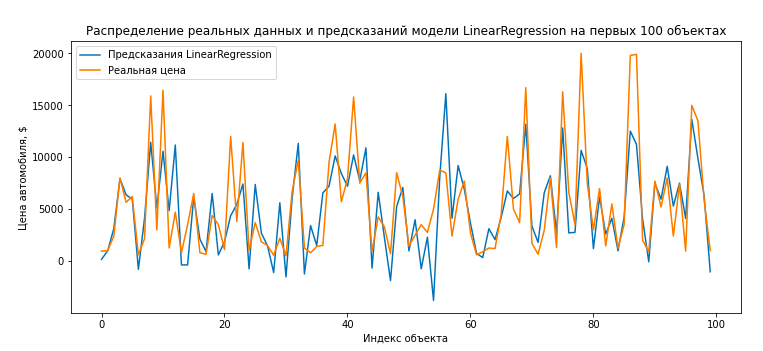
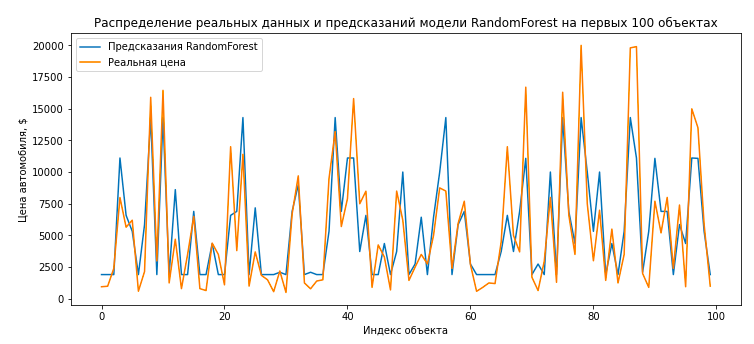

# 09. Численные методы

## Определение стоимости автомобилей

**Стек:** python / pandas / numpy / scikit-learn / scipy / matplotlib / lightgbm

**Описание проекта:** Сервис по продаже автомобилей хочет внедрить в свое приложение возможность оценки стоимости объекта продажи. Для этого в нашем распоряжении есть датасет предоставленный этим сервисом. 

**Задача:** Построить модель машинного обучения, которая поможет предсказать стоимость автомобиля. (Важным условием реализации является скорость работы алгоритма. Модель должна быть простой и быстрой)

**План реализации проекта:**
1. Загрузка данных
1. Предобработка данных
1. Предобработка данных для целей машинного обучения
1. Обучение моделей
1. Анализ моделей
1. Вывод

## Реализация проекта

### 1. Импорт библиотек. Загрузка данных

Данные лежат в датафрейме размера (354369 х 15). 

Нам доступны такие признаки объектов как:
- Марка автомобиля
- Модель автомобиля
- Год выпуска
- Мощность двигателя 
- и др.

**Вывод:**  Данные грязные. Большое количество пропусков.

### 2. Предобработка (тезисно)

- Объекты имеющие пропуски, которые можно восстановить - оставили. Пропущеные значения заполнили
- Те объекты, где пропуски заполнить нет возможности - отбросили.

**Вывод:**

Из 101тыс. обектов имеющих хотя бы 1 пропуск значения признака, мы лишились всего 7тыс. Это были объекты без информации о модели автомобиля и типе кузова. Такие данные внесли бы лишний шум. Поэтому, решено было их отбросить. Таким образом, нам удалось сохранить порядка 93% "проблемных" данных.

Данные предобработаны. Переходим к обучению моделей.

### 3. Предобработка данных для целей машинного обучения

- Категориальные признаки преобразовали методом *'One-hot-encoding'*
- Количественные признаки нормированы
- Аномалии отброшены
- Данные разбиты на выборки

**Размеры выборок:** обучающей / тестовой: (227523, 305) / (75842, 305)

### 4. Обучение моделей

Построим несколько регрессионых моделей. Для каждой модели, по возможности подберем несколько наилучших гиперпараметров с помощью GridSearchCV. Модели для перебора: 
- LightGBM
- LinearRegression
- RandomForestRegressor

**Проанализируем модели на качество:**

- RMSE score LGBM: 1864.93
- RMSE score LinearRegression: 2713.67
- RMSE score RandomForestRegression: 2686.91

- RMSE score DummyModel: 4558.75

**Вывод:**

Наилучший результат показала модель LGBM. Наглядно видно, что ей лучше удается предсказывать цены.
При этом, все модели прошли проверку на адекватность. Качество худшей модели LinearRegression практически в 2 раза лучше чем у Dummy модели.

**Оценим скорость работы моделей:**

- Скорость обучения LGBM: **96 секунд** *(при переборе 2 гиперпараметров по 3 вариации в каждом)*
- Скорость обучения LinearRegression: **28 секунд** *(без пербора параметров)*
- Скорость обучения RandomForestRegressor: **88 секунд** *(при переборе 2 гиперпараметров по 3 вариации в каждом)*

Быстрее всего обучается модель линейной регрессии. Имеем в виду, что подбора оптимальных параметров не происходит.  
Вследствие этого, как мы убедились, модель сильно теряет в качестве. 

Сравнимые результаты показали модели LGBM и RandomForestRegressor. Разница в 8 секунд, при этом, качество "деревянных" моделей сильно отстает от градиентного бустинга, и сравнимо с моделью линейной регрессии. Таким образом, использование модели RFR нецелесообразно, так как скорость ее работы сильно выше минимальной, а качество работы сильно хуже чем у лучшей модели. 

Возможно, стоит подобрать более оптимальные параметры на которых модели RFR покажут лучший score.

Скорость предсказания самая высокая у линейной регрессии. Очень близка скорость и у RFR. Градиентный бустинг предсказывает дольше всего, примерно в 7 раз дольше линейной регрессии.

### Общий вывод

Проведено исследование скорости и качества работы трех регрессионных моделей. По его результатам выяснено, что:

- **Лучшую скорость** обучения и предсказания показывает модель **линейной регрессии**, при этом имея худшее качество из трех моделей.
- **Лучшее качество** у модели **градиентного бустинга LGBM**. Качество примерно на 30% лучше, чем у других регрессоров. Но, LGBM имеет худшее время работы, в 3 раза бОльшее чем у быстрой линейной регрессии.
- **RandomForest имеет посредственные результаты**. Время работы сравнимое с худшим у LGBM и качество сравнимое с худшим у LinearRegression. Ее использование нецелесообразно. 

Таким образом, нам приходится выбирать "меньшее из зол". Для понимания того, какую из моделей стоит рекомендовать к внедрению, нужно разобраться с тем, что заказчику важнее - скорость или качество. Смею предположить, что в онлайн-сервисе по продаже автомобилей - скорость отклика ресурса - будет важнее, чем точность рекомендованной цены продажи авто. Автовладельцы чаще всего представляют, примерную стоимость своего железного коня. И рекомендательная система - это скорее приятный бонус, нежели жизненная необходимость. Поэтому, для целей заказчика я рекомендую воспользоваться быстродействующим алгоритмом линейной регрессии. Модель этого типа обучается в 3 раза быстрее LGBM, а качество имеет примерно на 30% хуже. При этом, ей все же удается неплохо отлавливать закономерности.

Не исключено, что существуют такие гиперпараметры LGBM, при которых модель имеет меньшее время обучения, сравнимое с линейной регрессией. Тогда, однозначно, такая модель была бы лучшим решением для построения рекомендательной системы.

