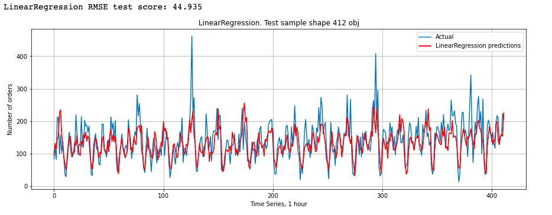
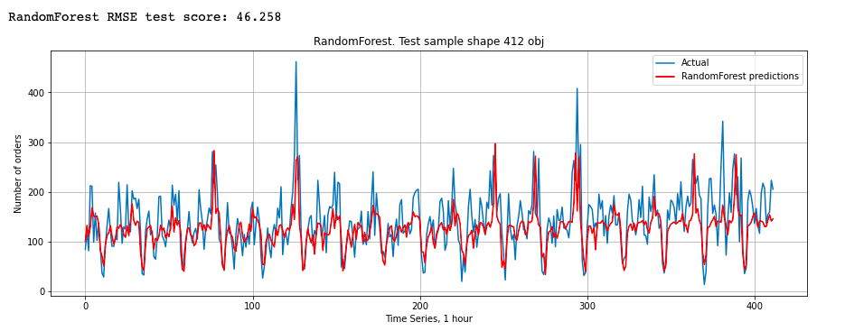
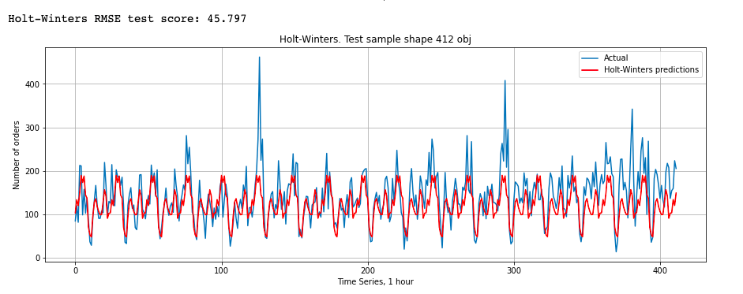
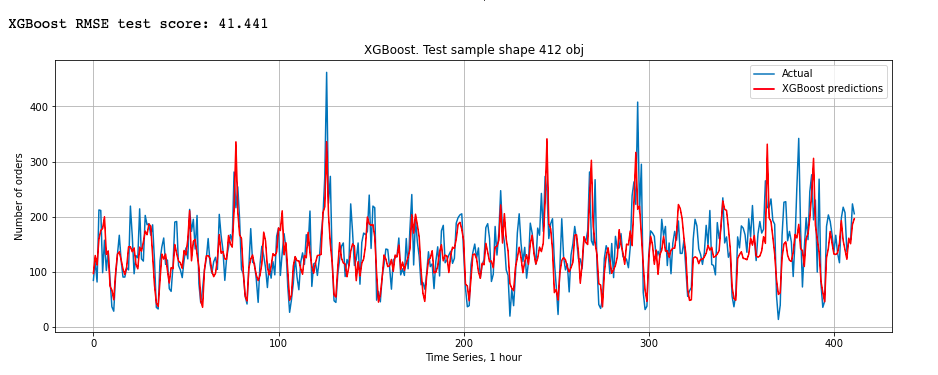
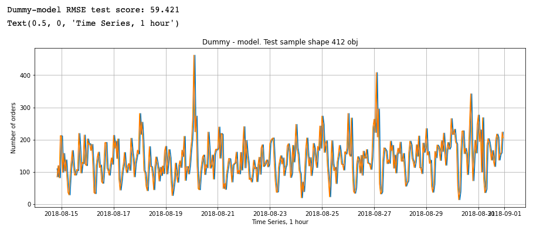

# Forecasting taxi orders. Time series project.

**Project description:** Компания «Чётенькое такси» собрала исторические данные о заказах такси в аэропортах. Чтобы привлекать больше водителей в период пиковой нагрузки, нужно спрогнозировать количество заказов такси на следующий час. Постройте модель для такого предсказания.

**Значение метрики RMSE на тестовой выборке должно быть не больше 48.**

So, the goal was to reach an RMSE value equal or less than 48. I've used different models from simple universal linear regression to specific time series model - ARIMA. Turns out the best model is boosting type model - XGBM Regressor. It's RMSE value is about 41. 
The results of the research are below:

*LinearRegression*

*RandomForest*

*Holt-Winters*

*XGBoost*

*Dummy-model*

