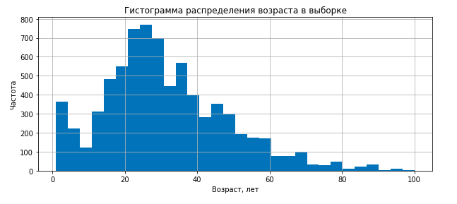
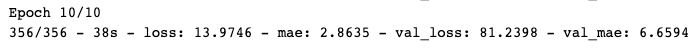

Первый проект по нейтронным сетям.
### Задача:
 Сетевой супермаркет «Хлеб-Соль» внедряет систему компьютерного зрения для обработки фотографий покупателей. Фотофиксация в прикассовой зоне поможет определять возраст клиентов, чтобы:
Анализировать покупки и предлагать товары, которые могут заинтересовать покупателей этой возрастной группы;
Контролировать добросовестность кассиров при продаже алкоголя.
Постройте модель, которая по фотографии определит приблизительный возраст человека. В вашем распоряжении набор фотографий людей с указанием возраста.*

### Реализация:
**1. Предварительный анализ** 

В нашем распоряжении есть датасет состоящий из 7591 фотографии. Все фотографии размечены по возрасту.

**2. Анализ данных.** 

В ходе предварительного анализа имеющегося датасета была построена гистограмма распределения фотографий по возрастам. Оказалось, что большая часть данных расположена в диапазоне 20 -30 лет. 

Фрагмент датасета:

**Предварительный вывод:** Фотографии достоточно хорошего качества. Можно предположить, что модели удастся лучше определять возраст 20-30 лет, так как там сосредоточена большая часть фотографий. Определить точный возраст пожилого человека (старше 60 лет) будет проблематично. Фотографий этой категории крайне мало. С другой стороны, люди на фотографиях достаточно разные. Разные позы, эмоции, аксессуары, прически и так далее. На мой взгляд, размера датасета в 7951 фото недостаточно для высокого качества модели.

**3. Обучение модели.** 

*Код модели можно найти в тетрадке.*

В качестве DL модели была выбрана модель ResNet, так как на этом же самом датасете она показала наилучший результат в [статье](http://people.ee.ethz.ch/~timofter/publications/Agustsson-FG-2017.pdf) MAE = 5.4. Было решено проверить справедливость результатов.

Параметры модели: В качестве загрузчика использовался ImageDataGenerator. Далее датасет разбивался на тренировочную и валидационную выборки в соотношение 3/1. Все значения были приведены к масштабу 0 - 1. В качестве аугментации было использовано только отражение по горизонтали. Количество батчей в одном потоке 16.

Для обучения была выбрана модель сверточной нейронной сети ResNet50. В качестве вурхних слоев взяли GlobalAveragePooling2D и Dense слой с одним нейроном и 'relu' активацией. 

- Оптимизатор модели = 'Adam', learning rate = 0.0001
- Функция потерь = 'mean_squared_error'
- Метрика = 'mae'

Результат обучения модели на 10 эпохах :

### Вывод:

По результатам обучения нам удалось добиться **MAE = 6.65**. Это значит, что модель ошибается в среднем на 6.5 лет в определении возраста. Что подтверждает результаты [статьи](http://people.ee.ethz.ch/~timofter/publications/Agustsson-FG-2017.pdf)

Смею предположить, что такого качества недостаточно для применения модели в качестве детектора несовершеннолетних граждан. Однако, мы можем увеличить буферную зону, т.е. поднять возрастную категорию граждан, которым необходимо предъявить паспорт с 18 лет до 25 лет. Тем самым мы увеличим Recall, что сделает модель гораздо более эффективной.

Полученная модель так же подойдет в качестве инструмента грубой сегментации покупателей по возрасту.

