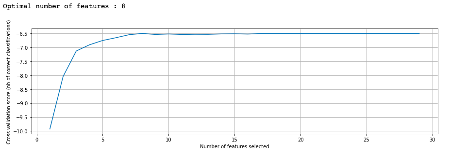

# 13. Выпускной проект

## Определение температуры стали

**Стек:** scikit-learn / scipy / matplotlib / lightgbm / catboost / lightgbm / xgboost / pyod

**Описание проекта:** В целях экономии электричества, металлургический комбинат решил убрать датчик измерения финальной температуры сплава из плавильного ковша.

**Задача:** Построить модель машинного обучения, которая поможет предсказать финальную температуру сплава в ковше.

**Технологическая схема:** Металл разогревают в плавильном ковше до температуры > 1500 °C. Здесь происходит первый замер температуры. Далее в сплав примешиваются лигирующие сыпучие добавки и проволочные материалы, с тем, чтобы металл обрел необходимые свойства. Все это время ковш периодически нагревают и измеряют температуру. На выходе получается одна партия металла. Нам доступна информация о нескольких тысячах партий.

**Условие:** 
- Целевая метрика *MAE*. 
- Построить модель с MAE < 8.5 

**План реализации проекта:**
1. Импорт библиотек. Загрузка данных
1. Анализ данных
1. Предобработка данных
1. Обучение моделей
1. Выявление самых информативных фичей
1. Вывод
1. Отчет

## Реализация проекта

### 1. Импорт библиотек. Загрузка данных

Данные состоят из файлов, полученных из разных источников:

- `data_arc.csv` — данные об электродах;
- `data_bulk.csv` — данные о подаче сыпучих материалов (объём);
- `data_bulk_time.csv` *—* данные о подаче сыпучих материалов (время);
- `data_gas.csv` — данные о продувке сплава газом;
- `data_temp.csv` — результаты измерения температуры;
- `data_wire.csv` — данные о проволочных материалах (объём);
- `data_wire_time.csv` — данные о проволочных материалах (время).

### 2. Анализ данных

В целом, имеется большое количество выбросов, как например: 

Распределение активной мощности похоже на нормальное, но имеет длинный правый хвост - выбросы.

- Таблицы о количестве и времени добавок имеют колосвльное количество пропусков. Больше 70%.

Посмотрим, как выглядит распределение температуры:

- В хвостах содержиться большое количество аномалий.
- Согласно wiki, температура плавления стали: 1450—1520 °C. На производстве ковш всегда подогревается чтобы недопустить остывания стали. Поэтому, все что ниже 1450 °C - точно выбросы.
- Имеют место нелогичные операции, когда первый технологический процесс начинается позже второго.

### 2. Предобработка (тезисно)

В первую очередь, данные были обработаны методами, которые не имеют риска утечки целевого признака.

**Цель** - свести все производственные данные в одну общую таблицу для передачи модели.

- Сначала отобрали таргет по следующим условиям:
  - Количество измерений температуры партии > 1
  - Финальный замер температуры должен быть последним звеном в производственной цепочке
  - Использование результатов промежуточных измерений температуры запрещено, т.к. считается ликом в данных
  - Данные результаты измерения температуры которых ниже температуры плавления стали - считаются выбросами
- Отобрали в выборки только те партии металла, у которых есть таргет.
- Использование промежуточных измерений запрещено, поэтому мы в качестве признака взяли первое измерение.
- Обогатили признаковое пространство. Добавили такие признаки как: полная мощность, отношение мощностей, суммарную активуную мощность и др.
- Заполнили нулями пропуски в таблицах с добавками
- Объединили все таблицы в итоговую
- Разбили итоговый фрейм на тренировочную и тестовую выборки
- Нормировали признаки

Итоговый датафрейм:

Размер датафрейма: (1758, 29)

### Обучение моделей

Выявили самые информативные фичи:

Таким образом, самыми важными являются такие признаки: 
- суммарная активная мощность
- количество сыпучих добавок №1, №6
- количество проволочных добавок №1, №2, №6
- начальная температура
- информация о продувке газом

Посмотрим как отобранные признаки коррелируют друг с другом:

Высокой корреляции нет. **Переходим к обучению.** Обучили такие модели:
- LinearRegression
- RandomForestRegressor
- CatBoostRegressor
- LightGBM
- XGBoost

**Результаты:**

### Вывод:

Целью исследования являлась оптимизация производственных расходов. Перед нами стояла задача определения финального значения температуры сплава в плавильном ковше. В качестве входных данных имелись объемные таблицы с информацией о времени, количестве добавок, температуре и др. 

В процессе предобработки выяснилось, что данные являются достаточно "сырыми", т.е. имеют большое количество пропусков, несостыковок по времени. Так же, имелись партии металла, которые в процессе производства не прошли необходимое количество стадий. Возможно, имел место технический сбой. Несмотря на вышесказанное, нам удалось выделить выборку в ~ 1000 объектов. 

Обучили 5 моделей. От простой линейной регрессии до бустингов. Самой результативной оказалась XGBoost.

**Рекомендции:** Можно еще очень долго улучшать модель. Как один из вариантов - воспользоваться алгоритмом автоматической генерации признаков, на основе имеющихся. Уверен, что в данных еще осталась большая доля информации, которая поможет сильно уменьшить ошибку предсказания. Плюс ко всему, можно подобрать лучшие параметры и для самого бустинга. Однако, оба этих метода очень затратны с точки зрения необходимого времени и вычислительной сложности.

